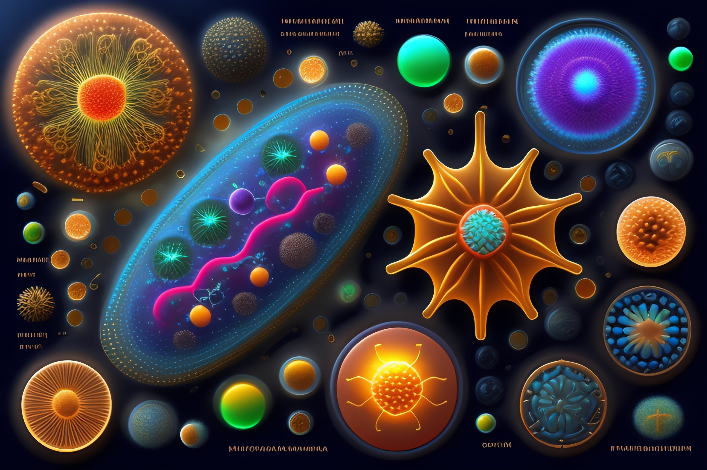
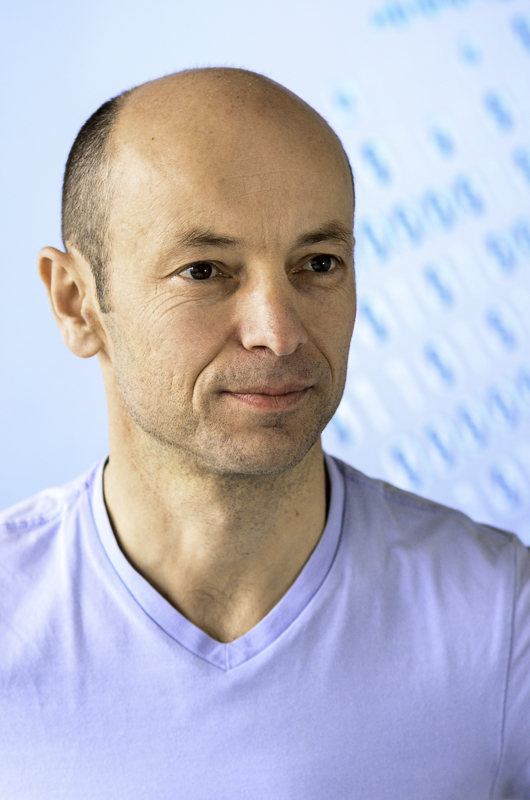

# Statistical Analysis of High-Throughput Genomic and Transcriptomic Data
The purpose is this library is to add all the exercises that will be required during the course Statistical Analysis of High-Throughput Genomic and Transcriptomic Data.
It will also be a great opportunity to get to know other people, discussing about what to improve for each exercise.

<div align="center">
  


</div>




## Lectures
Mondays 9.00-11:45 (Y27-H-46)


## Lecturers
<table border="0">
<tr><td>


</td><td>

[Prof. Dr. Mark Robinson](https://scholar.google.ch/citations?user=XPfrRQEAAAAJ), Group Leader of Genome Informatics at [FGCZ](http://www.fgcz.ch/)  

 

 

 

</td></tr><tr><td>




</td><td>

[Dr. Hubert Rehrauer](https://scholar.google.com/citations?user=utyZo6YAAAAJ&hl=en), Professor of Statistical Genomics, [DMLS](https://www.mls.uzh.ch/en.html), UZH  

 

 

 

</td></tr></table>

<!DOCTYPE html>
<html>
<head>
  <style>
    .timeline {
      position: relative;
      max-width: 800px;
      margin: 0 auto;
      padding: 20px;
    }

    .timeline::before {
      content: '';
      position: absolute;
      top: 0;
      left: 50%;
      height: 100%;
      width: 2px;
      background-color: #007bff;
    }

    table {
      width: 100%;
      border-collapse: collapse;
    }

    th, td {
      padding: 8px;
      text-align: left;
      border: 1px solid #ddd; /* Add a border to all table cells */
    }

    th {
      background-color: #f2f2f2;
    }

    tr:nth-child(even) {
      background-color: #f2f2f2;
    }

    tr:hover {
      background-color: #ddd;
    }
  </style>
</head>
<body>

<div class="timeline">
  <h1>My Timeline</h1>

  <table>
    <thead>
      <tr>
        <th>Date</th>
        <th>Lecturer</th>
        <th>Topic</th>
        <th>Exercise</th>
        <th>JC1</th>
        <th>JC2</th>
      </tr>
    </thead>
    <tbody>
      <tr>
        <td>18.09.2023</td>
        <td>Mark + Hubert</td>
        <td>admin; mol. bio. basics</td>
        <td>quarto; git(hub)</td>
        <td></td>
        <td></td>
      </tr>
      <tr>
        <td>25.09.2023</td>
        <td>Mark</td>
        <td>interactive technology/statistics session</td>
        <td>group exercise: technology pull request</td>
        <td></td>
        <td></td>
      </tr>
      <tr>
        <td>02.10.2023</td>
        <td>Hubert</td>
        <td>NGS intro; exploratory data analysis</td>
        <td>EDA in R</td>
        <td></td>
        <td></td>
      </tr>
      <tr>
        <td>09.10.2023</td>
        <td>Mark</td>
        <td>limma + friends</td>
        <td>linear model simulation + design matrices</td>
        <td></td>
        <td></td>
      </tr>
      <tr>
        <td>16.10.2023</td>
        <td>Hubert</td>
        <td>mapping</td>
        <td>Rsubread</td>
        <td></td>
        <td></td>
      </tr>
      <tr>
        <td>23.10.2023</td>
        <td>Hubert</td>
        <td>RNA-seq quantification</td>
        <td>RSEM</td>
        <td>X</td>
        <td>X</td>
      </tr>
      <tr>
        <td>30.10.2023</td>
        <td>Mark</td>
        <td>edgeR+friends 1</td>
        <td>basic edgeR/voom</td>
        <td>X</td>
        <td>X</td>
      </tr>
      <tr>
        <td>06.11.2023</td>
        <td>tba</td>
        <td>hands-on session #1: RNA-seq</td>
        <td>FASTQC/Salmon/etc.</td>
        <td>X</td>
        <td>X</td>
      </tr>
      <tr>
        <td>13.11.2023</td>
        <td>Mark</td>
        <td>edgeR+friends 2</td>
        <td>advanced edgeR/voom</td>
        <td>X</td>
        <td>X</td>
      </tr>
      <tr>
        <td>20.11.2023</td>
        <td>Hubert</td>
        <td>single-cell 1: preprocessing, dim. reduction, clustering</td>
        <td>clustering</td>
        <td>X</td>
        <td>X</td>
      </tr>
      <tr>
        <td>27.11.2023</td>
        <td>tba</td>
        <td>hands-on session #2: cytometry</td>
        <td>cytof null comparison</td>
        <td>X</td>
        <td>X</td>
      </tr>
      <tr>
        <td>04.12.2023</td>
        <td>Mark</td>
        <td>single-cell 2: clustering, marker gene DE</td>
        <td>marker gene DE</td>
        <td>X</td>
        <td>X</td>
      </tr>
      <tr>
        <td>11.12.2023</td>
        <td>tba</td>
        <td>hands-on session #3: single-cell RNA-seq (cell type definition, differential state)</td>
        <td>full scRNA-seq pipeline</td>
        <td>X</td>
        <td>X</td>
      </tr>
      <tr>
        <td>18.12.2023</td>
        <td>Mark</td>
        <td>spatial omics</td>
        <td>spatial statistics</td>
        <td>X</td>
        <td>X</td>
      </tr>
    </tbody>
  </table>
</div>

</body>
</html>


## Course material

For the course material, always follow what Professors say, you can check out the entire set of course materials with the following command (from command line):
```
git clone https://github.com/sta426hs2023/material.git
```  
and get updates by running `git pull` at any later time in the same directory.

Alternatively, to retrieve a ZIP file of the repository, you can click on the (green) 'Code' button (top right of main panel) and then click 'Download ZIP'.

## Nice Videos to See

1. [Intro to Cancer](https://www.youtube.com/watch?v=zFhYJRqz_xk&ab_channel=Kurzgesagt%E2%80%93InaNutshell)
   - Description: A captivating introduction to the world of cancer.
   - Duration: 9 minutes
   - Language: English
   - [Watch Video](https://www.youtube.com/watch?v=zFhYJRqz_xk&ab_channel=Kurzgesagt%E2%80%93InaNutshell)

2. [Why Cancer is So Hard to Beat](https://www.youtube.com/watch?v=uoJwt9l-XhQ&ab_channel=Kurzgesagt%E2%80%93InaNutshell)
   - Description: Explore the challenges in combating cancer and potential solutions.
   - Duration: 10 minutes
   - Language: English
   - [Watch Video](https://www.youtube.com/watch?v=uoJwt9l-XhQ&ab_channel=Kurzgesagt%E2%80%93InaNutshell)

3. [Intro to Cancer - German](https://www.youtube.com/watch?v=1AElONvi9WQ&t=2s&ab_channel=Kurzgesagt%E2%80%93InaNutshell)
   - Description: Eine fesselnde Einführung in die Welt des Krebses auf Deutsch.
   - Dauer: 8 Minuten
   - Sprache: Deutsch
   - [Video ansehen](https://www.youtube.com/watch?v=1AElONvi9WQ&t=2s&ab_channel=Kurzgesagt%E2%80%93InaNutshell)

4. [Intro to the Immune System](https://www.youtube.com/watch?v=lXfEK8G8CUI&t=574s&ab_channel=Kurzgesagt%E2%80%93InaNutshell)
   - Description: Learn about the fascinating world of the immune system.
   - Duration: 10 minutes
   - Language: English
   - [Watch Video](https://www.youtube.com/watch?v=lXfEK8G8CUI&t=574s&ab_channel=Kurzgesagt%E2%80%93InaNutshell)


## Author

<table border="0">
<tr><td>


</td><td>

[Guido Putignano](https://scholar.google.com/citations?user=ym2VggEAAAAJ&hl=en&oi=ao), Student at [UZH](http://www.fgcz.ch/)  


</td></tr></table>


## Upcoming Development

- [ ] **Knowledge:** Increase the number of videos in the list.
  - [ ] Find more videos online.
  - [ ] Enjoy the course.
  - [ ] Work hard and finish all the deliveries.

- [ ] **Sharing:** Have the Read.me in the main Github Page.
  - [ ] Have the assignment corrected.
  - [ ] Create Issue and Open discussions.
  - [ ] Be helpful.
