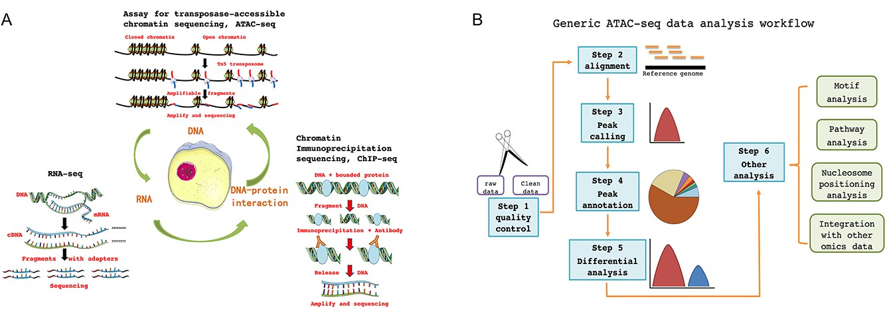
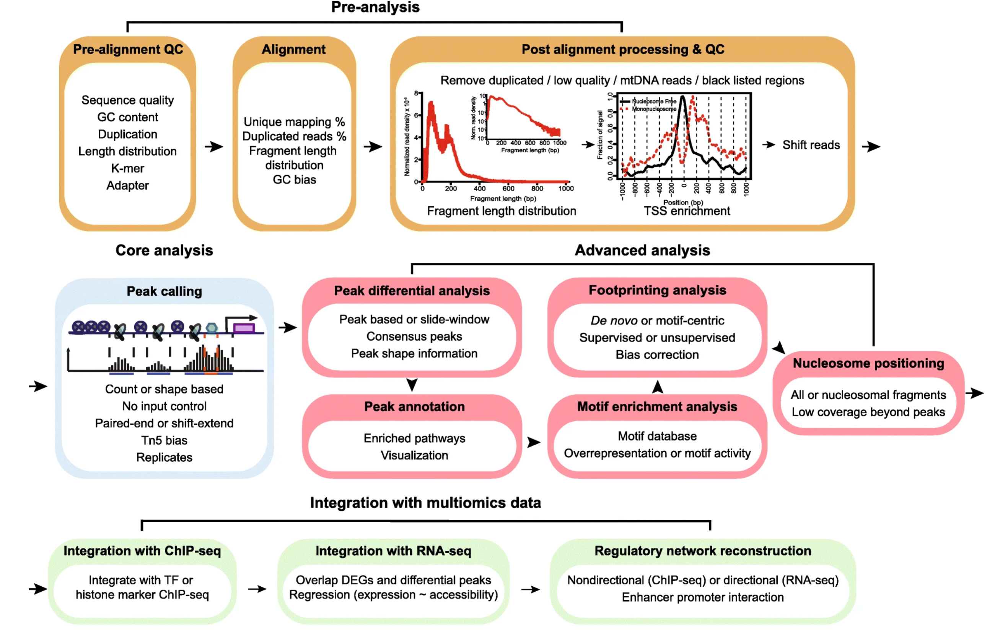
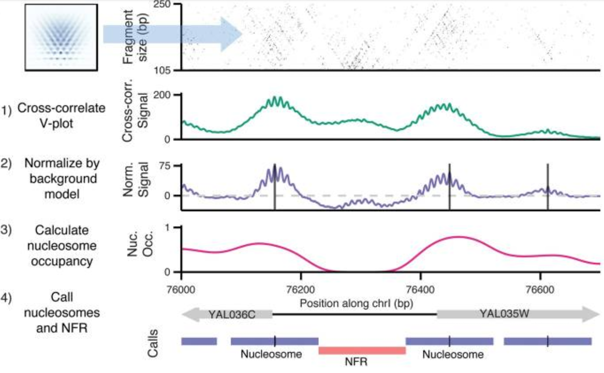

# Week 2 Exercise Part B
# ATAC-seq

## What is ATAC-seq
ATAC-seq is an abbreviation for 'Assay for Transposase-Accessible Chromatin with sequencing,' a molecular biology technique employed to evaluate the accessibility of chromatin throughout the entire genome. Chromatin accessibility pertains to the degree of compaction of DNA within the cell nucleus. Regions characterized by open or accessible chromatin are more prone to transcription into RNA and subsequent gene expression.
By analyzing what regions are open, it’s possible to understand what areas of the DNA are influencing the cell state, to study gene regulation, cell differentiation, and development, as well as to identify genetic risk factors for disease.

- **Image Source:** [What is ATAC-seq](https://academic.oup.com/bib/article/23/3/bbac061/6543486)

## How does ATAC-seq work
### Four steps:
- Tagmentation:
Resuspend the nuclei in tagmentation buffer.
Add the Tn5 transposase enzyme and sequencing adapters.
Incubate the reaction at 37°C for 30 minutes.

- DNA Purification:
Purify the tagged DNA fragments using a DNA purification kit.

- PCR Amplification:
Amplify the tagged DNA fragments using PCR primers.
Adjust the number of PCR cycles based on the desired sequencing depth.

- Sequencing:
Sequence the PCR-amplified DNA library using an NGS platform.

### Sequencing methods:
**Source** [Awesome ATAC-seq analysis](https://github.com/databio/awesome-atac-analysis)

There are multiple platforms for ATAC-Seq:
- __Signac:__ Signac is a comprehensive ATAC-seq data analysis pipeline that includes tools for peak calling, differential peak analysis, motif analysis, and visualization. It is designed to be flexible and scalable, and it can be used to analyze data from a variety of different ATAC-seq experiments.
- __SnapATAC:__ SnapATAC is a pipeline for ATAC-seq data analysis of single nuclei. It is designed to be fast and easy to use, and it provides a variety of features for quality control, peak calling, and differential peak analysis.
- __ATAC-pipe:__ ATAC-pipe is a pipeline for ATAC-seq data analysis that is integrated with the Galaxy platform. This makes it easy to run and share ATAC-seq data analysis workflows.
- __ATAC2GRN:__ ATAC2GRN is a pipeline for ATAC-seq data analysis that is integrated with the Gene Regulatory Network (GRN) inference tool. This allows you to identify regulatory networks that are associated with the ATAC-seq peaks.
- __Seq2science:__ Seq2science is a cloud-based platform for ATAC-seq data analysis. It provides a variety of tools for peak calling, differential peak analysis, motif analysis, and visualization. It is designed to be easy to use, even for users with no prior experience in ATAC-seq data analysis.

## How is ATAC-seq analysis conducted?
The four most important steps of ATAC-seq analysis include:
- Pre-analysis (quality control (QC) and alignment),
- Core analysis (peak calling),
- Advanced analysis at the level of peaks, motifs, nucleosomes, and TF footprints, 
- Integration with multi-omics data to reconstruct regulatory networks.

**Image Source:** [Four steps of ATAC-seq analysis](https://genomebiology.biomedcentral.com/articles/10.1186/s13059-020-1929-3)

## Interesting applications
**Source** [Applications of ATAC-seq](https://emea.illumina.com/techniques/popular-applications/epigenetics/atac-seq-chromatin-accessibility.html)
- __Disease-relevant regulatory mechanisms:__ ATAC-seq can be used to explore disease-relevant regulatory mechanisms. For example, researchers can use ATAC-seq to identify changes in chromatin accessibility that are associated with cancer, Alzheimer's disease, and other diseases. This information can help us to better understand how these diseases develop and to identify new therapeutic targets.

- __Comparative epigenomics:__ ATAC-seq can be used to perform comparative epigenomics studies. For example, researchers can use ATAC-seq to compare the chromatin accessibility of different populations of people in order to identify epigenetic differences that are associated with disease or other traits. This information can help us to better understand the role of epigenetics in human health and disease.

- __Biomarker discovery:__ ATAC-seq can be used to discover new biomarkers for disease. For example, researchers can use ATAC-seq to identify changes in chromatin accessibility that are associated with cancer, Alzheimer's disease, and other diseases. This information can be used to develop new tests for diagnosing and monitoring these diseases

- __Aging Studies:__ ATAC-seq is valuable for investigating chromatin accessibility changes associated with aging. Researchers can use ATAC-seq to identify alterations in the epigenetic landscape that occur as individuals age. By profiling open chromatin regions in different age groups, scientists gain insights into the epigenetic basis of aging-related phenotypes and age-associated diseases. This information contributes to our understanding of the aging process.

- __Transposable Element Analysis:__ ATAC-seq can be employed to study transposable elements (TEs), including retrotransposons and DNA transposons. TEs play a role in genome evolution and regulation. Researchers can use ATAC-seq to assess the impact of TEs on chromatin accessibility, gene regulation, and genome stability. Understanding TE dynamics is crucial for comprehending their involvement in various cellular processes and diseases.

## Benefits compared to other techniques

| Feature | ATAC-seq | ChIP-seq | RNA-seq |
|---|---|---|---|
| Input material requirement | Lower | Higher | Lower |
| Assay time | Shorter | Longer | Longer |
| Library preparation | In situ | Nuclei isolation required | RNA extraction required |
| Applicability to fresh-frozen tissue | Yes | Yes (with considerations) | Yes |
| Technical difficulty | Easier | More difficult | More difficult |
| What it measures | Chromatin accessibility | Protein-DNA binding | Gene expression |

## Summary
ATAC-seq is an abbreviation for 'Assay for Transposase-Accessible Chromatin with sequencing,' a molecular biology technique employed to evaluate the accessibility of chromatin throughout the entire genome. In this assay, next-generation sequencing (NGS) adapters are loaded onto the transposase, which allows simultaneous fragmentation of chromatin and integration of those adapters into open chromatin regions. The generated library can be sequenced by NGS and thus bioinformatic methods can be used to analyze the regions of the genome with open or accessible chromatin.

__The link (technology -> application -> statistics)__
| Technology | Application | Statistics |
| -------- | -------- | -------- |
| Neph  | Identifying Differential Accessibility Regions (DARs) in cancer cells that were associated with disease progression  | It exploits the Negative Binomial (NB) distribution to first calculate the read count for each region of the genome of two samples. It then calculates a p-value for each region of the genome, where the null hypothesis is the hypothesis that there is no difference in chromatin accessibility between the two samples. Finally, the Neph tool corrects the p-values for multiple testing using the Benjamini-Hochberg procedure, where the FDR is the probability of incorrectly identifying a region of the genome as being differentially accessible. The main goal of this method is to identify DARs as the regions of the genome that have a p-value less than the adjusted significance threshold |
| HINT-ATAC | Identifying DARs in cancer cells that were associated with drug resistance | It uses a hierarchical inference approach to model the read counts in each region of the genome as a mixture of negative binomial distributions. The hierarchical inference approach in HINT-ATAC allows the tool to identify DARs that are shared by multiple samples, as well as DARs that are specific to individual samples. This is important because it allows researchers to identify the regulatory elements that are involved in different biological processes. HINT-ATAC also uses a variety of statistical methods to control for false positives, including the Benjamini-Hochberg procedure and the Bonferroni correction. This helps to ensure that the DARs that are identified by HINT-ATAC are truly differentially accessible. |
| msCentipede | Identifying regulatory elements in the genome that were associated with the expression of genes involved in the immune response to infection | It is based on a hierarchical Bayesian model that accounts for the overdispersion and correlation structure of the data. This model allows msCentipede to identify DARs with high accuracy and sensitivity, even in the presence of low signal-to-noise ratios. |
| NucleoATAC | Identify the rotational and translational positions of nucleosomes with up to base-pair resolution and provide quantitative measures of nucleosome occupancy in S. cerevisiae, Schizosaccharomyces pombe, and human cells. | [Figure: Schematic of NucleoATAC workflow.] First, the V-plot nucleosome signature is cross-correlated against a 2D fragment size versus fragment midpoint representation of ATAC-seq data at a locus. The signal is then normalized by a background model (based on sequence bias and read depth) to obtain a normalized signal. Nucleosome occupancy is calculated using the local fraction of nucleosomal fragments. The normalized cross-correlation signal and nucleosome occupancy tracks are used to assign nucleosome and nucleosome-free (NFR) positions. |
| Integration of ATAC-seq with TCGA multi-omic data | Identify a large number of putative distal enhancers that distinguish molecular subtypes of cancers, uncover specific driving transcription factors via protein-DNA footprints, and nominate long-range gene-regulatory interactions in cancer. | A correlation-based model was developed to link ATAC-seq peaks to putative target genes. These putative links were validated using CRISPRi-based perturbation of the peak region followed by quantification of changes in gene expression. Publicly available HiChIP data and GTEx eQTL data were further used to support genome-wide peak-to-gene linkage predictions. Lastly, WGS and ATAC-seq were combined to identify non-coding mutations that affect chromatin accessibility in an allele-specific manner. |

Figure: Schematic of NucleoATAC workflow

- **Image Source:** [Structured nucleosome fingerprints enable high-resolution mapping of chromatin architecture within regulatory regions](https://www.ncbi.nlm.nih.gov/pmc/articles/PMC4617971/)

Finally, we would like to remind you that the choice of statistical model is not univocal and depends on the specific type of analysis that is being performed
- The NB distribution is typically used to identify differentially accessible regions (DARs) between two or more samples;
- The Poisson distribution can be used to model the read count in a particular region of the genome;
- The log-normal distribution can be used to model the normalized read count in a particular region of the genome;
- The beta-binomial distribution can be used to model count data that is overdispersed and bounded between 0 and 1, such as the proportion of reads that map to a particular region of the genome.

## Github Usernames
<table border="0">
<tr><td>

</td><td>

[guidoputignano](https://github.com/guidoputignano) [Guido Putignano]

</td></tr><tr><td>

</td><td>

Jade0904 [Zhihan Zhu]

</td></tr><tr><td>

</td><td>

[NianzhenGu](https://github.com/NianzhenGu) [Nianzhen Gu]

</td></tr><tr><td>

</td><td>

GianfrancoBotta [Gianfranco Botta]

</td></tr></table>
